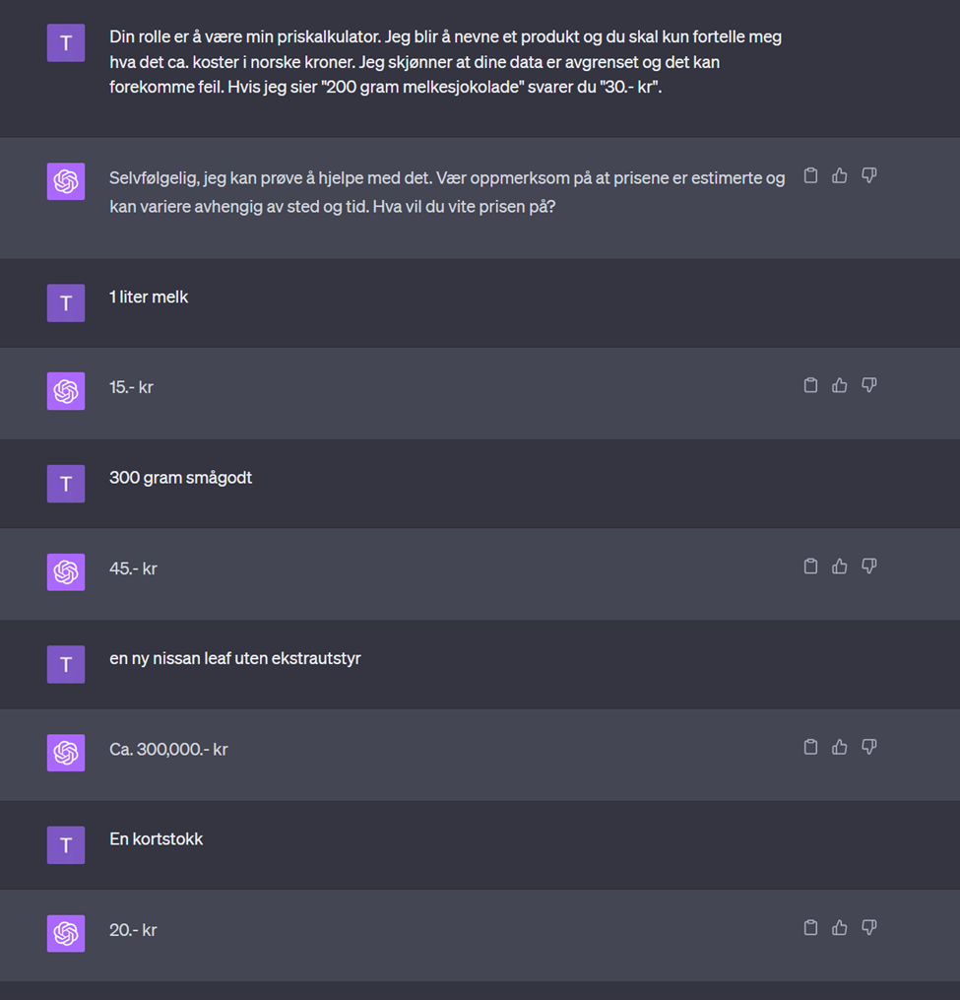

# En guide til effektiv bruk av ChatGPT som verktøy

Det er viktig å forstå at ChatGPT er en kraftig teknologi som kan brukes til veldig mange formål. Det er viktig å forstå at dette er et verktøy som er trent på ekstreme mengder med data som er hentet fra internett. Per i dag er den trent på data frem til september 2021. Det betyr at den også er trent på data som rett og slett er feil. Det er derfor viktig å være skeptisk til alt den sier. Dette er lettere å plukke opp hvis man har en god forståelse om temaet i samtalen. 

Har man ingen kunnskap om temaet fra før er det ingen måte for deg å vite om den snakker sant eller ikke.  Da er det ekstra viktig å sjekke opp svarene med kilder man stoler på. Eks. på gode kilder å sjekke mot er oppdaterte lærebøker eller en person som er kompetent innenfor temaet. 

Selv om det er en fantastisk teknologi som kan hjelpe deg med nesten alt, så er det viktig å huske på at det er et hjelpemiddel. «Du sitter i førerstolen og dette er assistenten din» er en veldig bra tilnærming. 

## «Hallusinering»
Det er et kjent fenomen i AI-verden at verktøy som OpenAI sin ChatGPT og google sin «Bard» kan «hallusinere». Det betyr at den kan gi deg falsk informasjon eller fakta som ikke er basert på ekte data eller hendelser. F.eks. kan den fortelle om «Geir Jensen», en norsk fotballspiller som spilte for Real Madrid i 10 år og ble kåret til verdens beste fotballspiller 5 år på rad. De sier at dette er gjerne et symptom når brukeren gir veldig uklare og forvirrende input. 

# Hvordan bruker man verktøyet effektivt?
Du må forstå at ChatGPT ikke kjenner til hvem du er, hva du kan og hva du spesifikt vil vite med mindre du gir den et grunnlag. Hvis du spør «Kan du fortelle meg om <tema>» / «Hva er <tema>»?» så får du et veldig generelt svar. Dette er riktig måte å gå frem for deg som vil lære om hva som faktisk inngår i et tema, men ikke mer enn det. «Hva er naturfag?», så kan du fortsette med «Hvorfor er naturfag viktig?». 

Men, ChatGPT kan være mye mer fleksibel enn det. Du kan be den ta en hvilken som helst rolle du vil. Hva med en priskalkulator?

Her kan man være veldig kreativ, det er bare å prøve seg frem😊

I situasjoner der man jobber med veldig spesifikke problemstillinger er det viktig at gpt-modellen kjenner til hva dere jobber med for å få et så bra svar som mulig. Hvis dere programmerer en robot for first lego league og møter på problemer dere ønsker hjelp med er en bra fremgangsmåte noe slikt:
«Vi programmerer en robot i forbindelse med first lego league. Vi har en fargesensor som vi ønsker skal se forskjellen mellom svart og hvit når roboten beveger seg på en veldig lys robotmatte. Vi har prøvd å justere lysverdiene for at roboten skal treffe den hvite linjen, men det har ikke fungert som vi vil. Den kan plutselig drifte før den når linjen. Hva kan vi undersøke og justere for å få roboten til å se linjen og se bort fra andre ting på robotmatten. Vi bruker mindstorms EV3, versjon 1.5.4 og …..».

Hvis dette er vanskelig å formulere selv, kan du snu samtalen og fortelle ChatGPT at dere har et problem med å programmere roboten og spørre den hva slags informasjon den trenger for å hjelpe dere og ta samtalen videre derfra 😊

## Liten fun fact
Når OpenAI(selskapet som utvikler og eier denne tjenesten) åpnet opp tjenesten for offentligheten rundt november 2022 kalte de den «ChatGPT». Dette er et alias/kallenavn for gpt-modellen deres med versjon 3.5. Som betalende bruker har du nå tilgang til gpt-4 som er en enda bedre versjon. Det betyr at ChatGPT ikke er det samme som gpt-4, men folk kaller det gjerne for ChatGPT.

